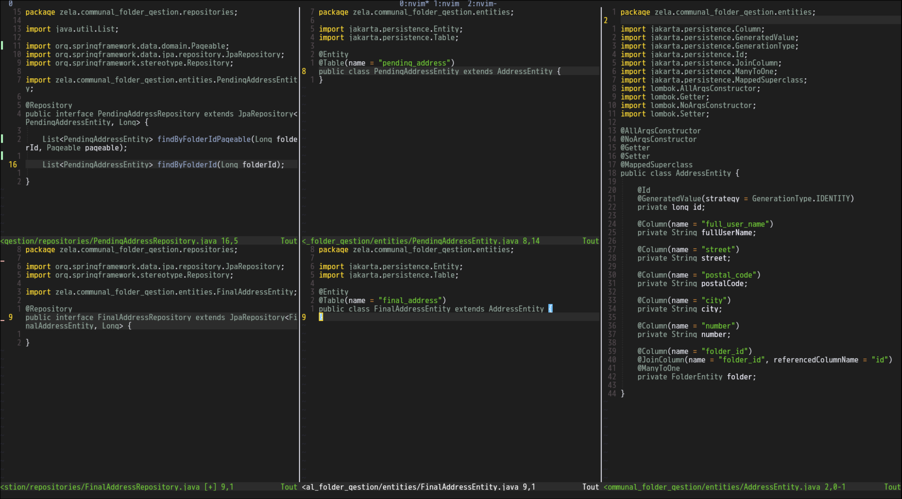

# Folder and Address Management Backend

Contexte

Vous devez implémenter le backend d’une application métier permettant de gérer des dossiers et les adresses associées à ces dossiers.

Un utilisateur peut consulter une liste paginée d’adresses et effectuer différentes actions sur celles-ci : ajouter, modifier ou supprimer.

Dans cette application, les modifications ne sont pas appliquées immédiatement en base de données. Elles doivent rester en draft jusqu’au moment où l’utilisateur décide de les enregistrer.

L’utilisateur doit toujours voir sa liste paginée avec les modifications draft appliquées, même si elles n’ont pas encore été sauvegardées.

 
Solution conseillée

Pour produire la liste finale visible par l’utilisateur, il est conseillé d’utiliser une vue SQL, éventuellement matérialisée pour améliorer les performances.

Les entités JPA peuvent être, par exemple :

    Address : les adresses validées (table principale)
    PendingAddress : les modifications draft
    MergedAddress : mappée sur la vue SQL représentant la liste finale

Cette approche est fortement recommandée, mais reste optionnelle.

 
Endpoints suggérés

    POST /dossiers → créer un nouveau dossier
    GET /dossiers/{id}/addresses?page=<numéro>&pageSize=<taille> → retourne la liste paginée avec les modifications draft appliquées
    POST /dossiers/{id}/addresses → ajoute une adresse (draft)
    PUT /addresses/{id} → modifie une adresse (draft)
    DELETE /addresses/{id} → supprime une adresse (draft)
    DELETE/addresses → supprime plusieurs addresses (draft)
    POST /pending-addresses/{id}/cancel → annule une modification draft
    POST /dossiers/{id}/save → applique toutes les modifications draft

 
Travail demandé

Implémentez le backend permettant de gérer les modifications draft et de retourner la liste paginée des adresses, avec les changements visibles par l’utilisateur.

## V1 avec trois enités : Address, PendingAddress et MergedAddress

# API Routes

## Folder Routes

| Method | Route | Action | JSON Body |
|------|------|------|------|
| POST | /folders/save | Create a new folder | `{ "name": "My Folder" }` |
| DELETE | /folders/delete/{id} | Delete a folder | none |
| GET | /folders/{id}/addresses?page=0&size=10 | Get addresses of a folder (paginated) | none |
| POST | /folders/{id}/address | Add a pending address to a folder | `{ "fullUserName": "John Doe", "street": "Main Street", "postalCode": "6000", "city": "Charleroi", "number": "12" }` |
| POST | /folders/{id}/save | Confirm and save all pending addresses in the folder | none |

---

## Address Routes

| Method | Route | Action | JSON Body |
|------|------|------|------|
| PUT | /addresses/{id} | Update an address | `{ "fullUserName": "Jane Doe", "street": "Second Street", "postalCode": "1000", "city": "Brussels", "number": "45" }` |
| DELETE | /addresses/{id} | Delete one address | none |
| DELETE | /addresses | Delete multiple addresses | `[1,2,3]` |
| POST | /addresses/pending-addresses/{id}/cancel | Cancel pending modifications for a folder | none |
